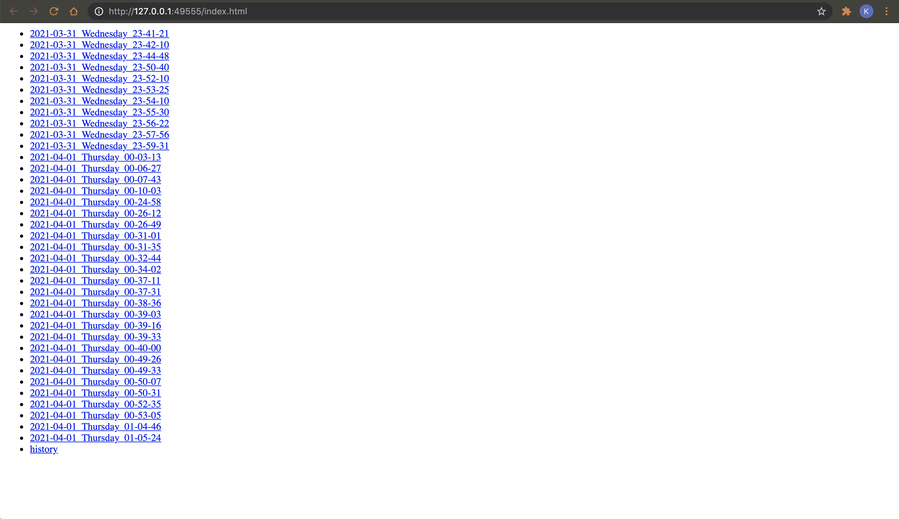
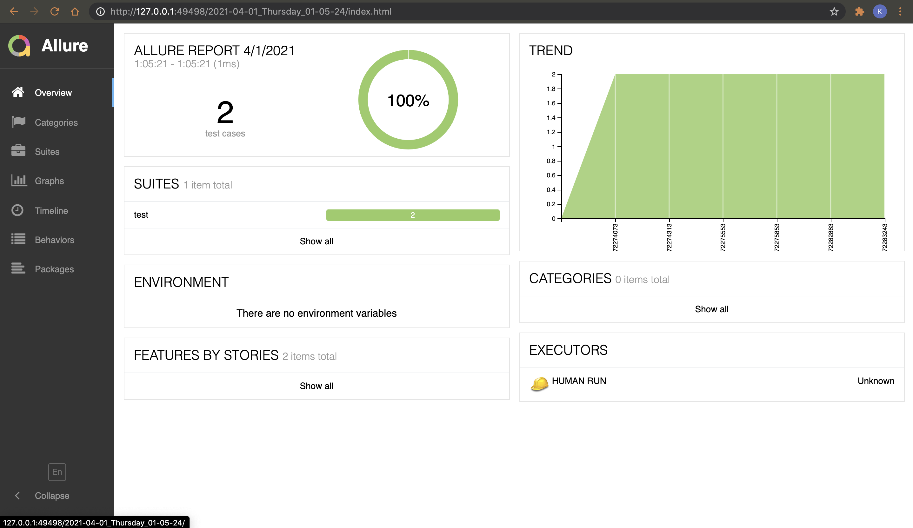
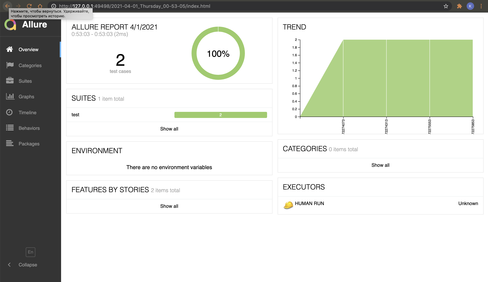

# allure-local-history-bash
Script to generate local allure reports with history trends.

## Usage
`bash allure_generate.sh`

Recipe
1. Use allure-framework.
2. Save results into alluredir=`allure-results`.
3. Run the script from current repository `bash allure_generate.sh`.
4. Result: Allure Report will be generated into `/allure` directory with allure-history trends.

Run tests. Execute allure_generate.sh. Repeat. You will receive list of allure-reports

```
allure/2021-03-30_Wednesday_23-59-31
allure/2021-04-01_Thursday_00-03-13
allure/2021-04-01_Thursday_00-06-27
```

Use `allure open allure` and you will see the reports tree



Choose the latest report, or the report you need and open it



You can jump back through build history trend



## Advanced usage
`bash allure_generate.sh custom-results custom-reports`

- `custom-results` - from custom alluredir; `default='allure-results'`
- `custom-reports` - to custom allure root tree directory; `default='allure'`
